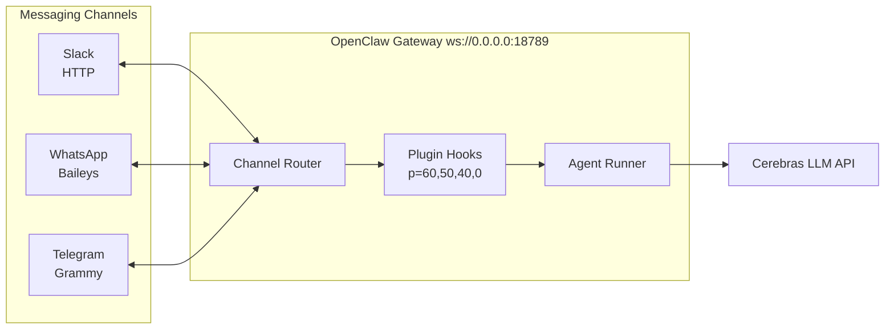
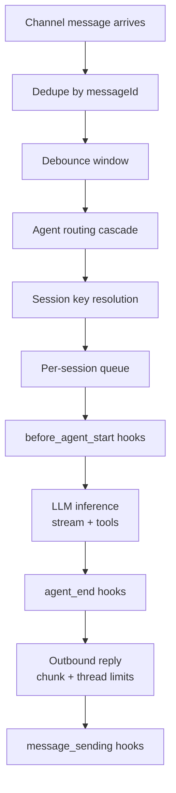
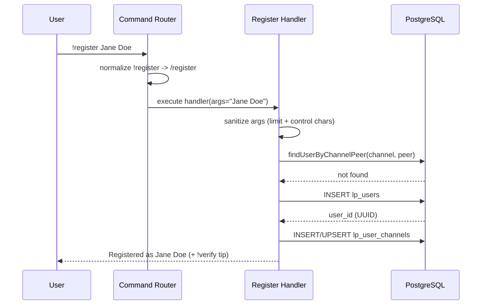
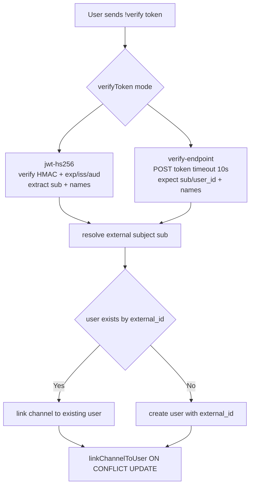
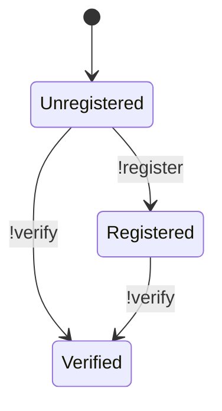
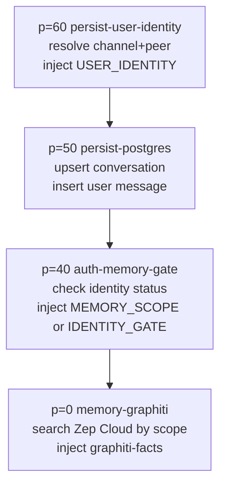

# Syntropy Identity-Scoped Memory Pipeline

Technical reference for the multi-channel identity, authentication, and memory system built on OpenClaw.

---

## 1. Multi-Channel Gateway

### Architecture

OpenClaw runs a single long-lived Gateway daemon that owns all messaging surfaces. Every channel — Slack, WhatsApp, Telegram, Discord, iMessage, Matrix, etc. — connects through the same process on a single port (default `18789`). The Gateway exposes a typed WebSocket API for control-plane clients (CLI, web UI, macOS app) and a separate HTTP surface for webhooks and the OpenAI-compatible API.



### Session Key Isolation

Session keys are the fundamental unit of conversation isolation. For multi-user inboxes, the `dmScope: "per-channel-peer"` setting generates deterministic keys per sender per channel:

| Chat Type   | Session Key Format                               |
| ----------- | ------------------------------------------------ |
| Slack DM    | `agent:main:slack:direct:u08qbefpbv0`            |
| WhatsApp DM | `agent:main:whatsapp:direct:5511999887766`       |
| Telegram DM | `agent:main:telegram:direct:123456789`           |
| Group chat  | `agent:main:slack:group:c08xyz123`               |
| Thread      | `agent:main:slack:group:c08xyz123:thread:ts1234` |

Without `per-channel-peer`, all DMs share one session context — a direct data-isolation violation for any multi-user deployment.

### Inbound Message Flow



### Routing Cascade

When multiple agents are configured, inbound messages are routed through an 8-step priority cascade:

1. **Exact peer** — binding matches specific `channel:peerId`
2. **Parent peer** — thread inherits from parent conversation
3. **Guild + roles** — Discord server + role match
4. **Guild** — Discord server match
5. **Team** — Slack workspace match
6. **Account** — channel account match
7. **Channel** — wildcard `accountId: "*"` match
8. **Default agent** — first configured, falls back to `main`

For single-agent deployments (our current setup), all messages route to `agent:main`.

---

## 2. Chat-Based Registration and Token Authentication

### Command System

Users interact with the identity system through chat commands prefixed with `!` (chosen over `/` because Slack intercepts all `/`-prefixed text as native slash commands).

| Command                    | Effect                                    | Auth Required |
| -------------------------- | ----------------------------------------- | ------------- |
| `!register <first> <last>` | Create channel-only identity              | No            |
| `!verify <jwt-token>`      | Link channel to verified identity via JWT | No            |

Commands are dispatched through the plugin command registry (`src/plugins/commands.ts`). The `matchPluginCommand` function normalizes `!` to `/` for internal registry lookup — commands are stored with `/` prefix but accept both `!` and `/` from users.

### Registration Flow



After registration, the user has a **channel-only identity** — isolated to the channel they registered from, no cross-channel linking.

### Token Verification Flow



A verified user has an `external_id` (from the JWT `sub` claim) that enables cross-channel memory continuity. The same person on Slack, WhatsApp, and web chat shares one memory namespace.

### Identity Status Transitions



### JWT Claims Schema

| Claim         | Required | Purpose                                                             |
| ------------- | -------- | ------------------------------------------------------------------- |
| `sub`         | Yes      | Becomes `external_id` — the cross-channel identity key              |
| `exp`         | Yes      | Token expiry (Unix timestamp)                                       |
| `iss`         | No       | Issuer validation (rejected if config specifies and mismatch)       |
| `aud`         | No       | Audience validation (rejected if config specifies and not in array) |
| `given_name`  | No       | Auto-populates `first_name` on user record                          |
| `family_name` | No       | Auto-populates `last_name` on user record                           |
| `name`        | No       | Fallback: split on space for first/last name                        |

---

## 3. Auth-Memory Gate

### Purpose

The auth-memory-gate plugin sits between identity resolution and memory retrieval. It enforces access control over the memory layer — preventing unidentified users from accessing or contributing to the knowledge graph.

### Hook Chain (Priority Order)

Each inbound message triggers `before_agent_start` hooks in priority order. The four plugins execute as a pipeline:



### Gating Modes

| `hardGate` | `requireVerified` | Unregistered | Registered          | Verified    |
| ---------- | ----------------- | ------------ | ------------------- | ----------- |
| `false`    | `false`           | Open         | Full access         | Full access |
| `true`     | `false`           | **LOCKED**   | Full access         | Full access |
| `true`     | `true`            | **LOCKED**   | **LOCKED**          | Full access |
| `false`    | `true`            | Open         | Memory gated (soft) | Full access |

**Current deployment**: `hardGate: true`, `requireVerified: false` — unregistered users are completely locked out; a simple `!register` is sufficient to unlock.

### Hard Gate Mechanism

When a hard gate is active, the plugin injects an `[IDENTITY_GATE]` block into the agent's system context that constrains the LLM to only discuss verification:

```
[IDENTITY_GATE]
status: LOCKED
channel: slack
channel_peer_id: u08qbefpbv0
[/IDENTITY_GATE]

IMPORTANT: This user has NOT been identified. You MUST NOT proceed with
any request until they verify their identity.
```

**Safety net**: A `message_sending` hook (priority 30) monitors all outgoing messages. If the recipient is in the in-memory `gatedPeers` Set, a verification CTA is appended to the response — catching cases where the LLM ignores the system prompt.

### Memory Scope Resolution

For authenticated users, the plugin injects a `[MEMORY_SCOPE]` block:

```
[MEMORY_SCOPE]
scope_key: ext-user-abc123        ← from external_id (cross-channel)
user_id: 7f3a2b1c-...             ← internal UUID
external_id: ext-user-abc123
verified: true
gated: false
[/MEMORY_SCOPE]
```

The `scope_key` is the primary partition key for all downstream memory operations:

- **Verified users**: `scope_key = external_id` — same memory across all channels
- **Channel-only users**: `scope_key = user_id` (internal UUID) — per-channel isolation

---

## 4. Chat Persistence

### Database Schema

All plugins share a single PostgreSQL database with the `lp_` table prefix:

```mermaid
erDiagram
  LP_USERS ||--o{ LP_USER_CHANNELS : "has channels"
  LP_CONVERSATIONS ||--o{ LP_MESSAGES : "contains messages"

  LP_USERS {
    uuid id PK
    varchar external_id
    varchar first_name
    varchar last_name
    timestamptz created_at
    timestamptz updated_at
  }

  LP_USER_CHANNELS {
    uuid id PK
    uuid user_id FK
    varchar channel
    varchar channel_peer_id
    timestamptz linked_at
  }

  LP_CONVERSATIONS {
    uuid id PK
    varchar channel
    varchar session_key UNIQUE
    int message_count
    timestamptz created_at
    timestamptz last_message_at
  }

  LP_MESSAGES {
    uuid id PK
    uuid conversation_id FK
    varchar role
    text content
    timestamptz created_at
  }
```

### Write Path

| Event              | Plugin                  | SQL Operation                                                                |
| ------------------ | ----------------------- | ---------------------------------------------------------------------------- |
| User sends message | persist-postgres (p=50) | `UPSERT lp_conversations` + `INSERT lp_messages (role='user')`               |
| Agent replies      | persist-postgres (p=50) | `UPSERT lp_conversations` + `INSERT lp_messages (role='assistant')`          |
| Message counter    | persist-postgres        | Atomic CTE: `INSERT message` + `UPDATE conversations SET message_count += 1` |

### Read Path (Identity Resolution)

Three plugins independently query `lp_users JOIN lp_user_channels` to resolve identity. Each maintains its own copy of the query (no shared import):

| Plugin                | Query Purpose                                | When                        |
| --------------------- | -------------------------------------------- | --------------------------- |
| persist-user-identity | Full user record for `[USER_IDENTITY]` block | `before_agent_start` (p=60) |
| auth-memory-gate      | Identity check for gate/scope decision       | `before_agent_start` (p=40) |
| memory-graphiti       | Resolve `scope_key` for graph partitioning   | `before_agent_start` (p=0)  |

### Connection Management

Each plugin opens its own connection pool (`postgres(url, { max: 10 })`). All pools are closed on `gateway_stop` (priority 90). Lazy initialization: the first `before_agent_start` call triggers schema creation and connectivity check.

---

## 5. Memory Layer (Graphiti / Zep Cloud)

### How Memory Works

The `memory-graphiti` plugin uses Zep Cloud as a graph-based knowledge store. It operates in two modes:

**Auto-Recall** (`before_agent_start`, priority 0):

1. Resolve `scope_key` via identity DB query
2. Call `client.searchFacts(userMessage, [scopeKey], maxFacts)`
3. Inject matching facts as `prependContext` block

**Auto-Capture** (`agent_end`, priority 0):

1. Extract user + assistant messages from the completed turn
2. Resolve `scope_key`
3. Fire-and-forget: `client.addMessages(scopeKey, messages)`

### Group ID Strategy

| Strategy         | Group ID Source                                         | Cross-Channel     |
| ---------------- | ------------------------------------------------------- | ----------------- |
| `identity`       | `external_id` from `lp_users` (falls back to `user_id`) | Yes (if verified) |
| `session`        | Full session key string                                 | No                |
| `channel-sender` | `{channel}:{peerId}`                                    | No                |

**Current deployment**: `groupIdStrategy: "identity"` — verified users get unified memory across all channels.

### Agent Tools

The plugin registers two tools available to the LLM during conversation:

| Tool                | Parameters       | Purpose                                              |
| ------------------- | ---------------- | ---------------------------------------------------- |
| `graphiti_search`   | `query: string`  | Manual semantic search of the user's knowledge graph |
| `graphiti_episodes` | `limit?: number` | Retrieve recent episode records                      |

These tools use the `lastGroupId` from the most recent `agent_end` hook — scoped to the current user's namespace.

---

## 6. Tools for User Context Retrieval

### Current State

The pipeline currently injects user context through `prependContext` blocks — text prepended to the agent's system prompt on each turn. This is a passive, prompt-injection approach: the LLM sees the context but cannot actively query or refine it.

| Context Block      | Source                | Content                                 |
| ------------------ | --------------------- | --------------------------------------- |
| `[USER_IDENTITY]`  | persist-user-identity | user_id, name, channel, verified status |
| `[MEMORY_SCOPE]`   | auth-memory-gate      | scope_key, gated status                 |
| `<graphiti-facts>` | memory-graphiti       | Up to 10 recalled facts                 |

### Existing Tool Surface

OpenClaw's built-in tool inventory includes several relevant capabilities:

| Tool                | Status          | Relevance                                                       |
| ------------------- | --------------- | --------------------------------------------------------------- |
| `memory_search`     | Built-in        | Searches OpenClaw's native Markdown memory files (not Graphiti) |
| `memory_get`        | Built-in        | Reads specific memory files from `MEMORY.md` / `memory/`        |
| `graphiti_search`   | Plugin (active) | Semantic search of the user's Zep Cloud graph                   |
| `graphiti_episodes` | Plugin (active) | Retrieve recent episodes from Zep Cloud                         |
| `sessions_history`  | Built-in        | Fetch transcript from another session                           |
| `sessions_list`     | Built-in        | List sessions with metadata                                     |

### Gaps and Proposed Additions

**1. User Profile Tool**

Currently, the agent sees user identity only as a static text block. A dedicated `user_profile` tool would allow the agent to actively query the identity database:

```
user_profile(action: "get")
  → { user_id, external_id, name, channels: [{channel, peerId, linkedAt}], verified, registeredAt }

user_profile(action: "list_channels")
  → [{channel, peerId, linkedAt}]
```

This enables the agent to answer "what channels am I connected from?" or "when did I register?" without the information needing to be in every prompt.

**2. Scoped Memory Search Tool (Enhanced)**

The existing `graphiti_search` tool uses the `lastGroupId` from the previous turn — a stale reference in long sessions. A scope-aware variant would resolve the identity on each call:

```
scoped_memory_search(query: "my blood pressure readings", scope: "self")
  → resolves scope_key from current session's identity
  → searches only within that user's graph namespace

scoped_memory_search(query: "clinic protocol for NAD+", scope: "shared")
  → searches a shared knowledge base (e.g., clinic protocols)
```

**3. Context Summary Tool**

For long-running sessions, a tool that returns a structured summary of the current user's context window:

```
context_summary()
  → {
      identity: { name, verified, channels },
      memory: { factsLoaded: 8, lastRecall: "2m ago" },
      conversation: { messageCount: 42, sessionAge: "3h", compactions: 1 },
      gate: { status: "open", scopeKey: "ext-abc123" }
    }
```

This gives the agent self-awareness about what context it has — useful for deciding whether to search for more facts or whether to recommend the user verify to unlock cross-channel memory.

**4. Preference Write-Back Tool**

Currently, memory capture is automatic and opaque (fire-and-forget on `agent_end`). An explicit tool would let the agent store structured preferences:

```
user_preference(action: "set", key: "timezone", value: "America/Los_Angeles")
user_preference(action: "set", key: "preferred_name", value: "Mo")
user_preference(action: "get", key: "timezone")
user_preference(action: "list")
```

Backed by a `lp_user_preferences` table keyed by `(user_id, key)`, with the agent able to read and write. This avoids the lossy natural-language-to-graph-extraction pipeline for structured data.

---

## 7. Optimization Directions

### Short-Term

**Reduce redundant DB queries.** Three plugins independently query `lp_users JOIN lp_user_channels` on every message. A shared identity resolution layer — either a module-level cache with TTL or a single "identity provider" that other plugins subscribe to — would cut DB round-trips from 3 to 1 per inbound message.

**Connection pool consolidation.** Each plugin opens its own `postgres()` pool (up to 10 connections each). Four plugins = 40 potential connections to the same database. A shared pool passed via plugin context would reduce resource pressure.

**Lazy Graphiti recall.** The `before_agent_start` hook always calls `searchFacts`, even when the user is sending a command (`!register`, `!verify`) or a trivial message. Skip recall for messages shorter than a threshold or when the message matches a known command pattern.

### Medium-Term

**Tool-based context retrieval over prompt injection.** The current `prependContext` approach injects all available context on every turn, regardless of whether the agent needs it. Moving to on-demand tool calls (the agent decides when to search memory or check identity) would:

- Reduce prompt token usage on simple exchanges
- Give the agent control over retrieval specificity
- Enable multi-step retrieval (search → refine → search again)

The trade-off: tool-based retrieval requires the model to recognize when it needs context, which may miss relevant information on the first turn. A hybrid approach — inject minimal context (identity + gate status) via `prependContext`, make rich context (facts, history, preferences) available via tools — balances both.

**Structured memory alongside graph memory.** Graphiti excels at extracting and linking facts from natural language. But structured data (biomarker readings, appointment dates, medication schedules) is better stored in typed tables with proper indexes. A `lp_user_data` table with `(user_id, category, key, value, timestamp)` columns would complement the graph layer for data that needs exact retrieval rather than semantic search.

**Session-aware compaction hooks.** When OpenClaw compacts a session (summarizing to fit the context window), the current pipeline loses the injected `[USER_IDENTITY]` and `[MEMORY_SCOPE]` blocks. A `before_compaction` or `after_compaction` hook that re-injects identity context would prevent "identity amnesia" after long conversations.

### Long-Term

**Cross-session context sharing.** The `sessions_send` and `sessions_spawn` tools already enable inter-session communication. Extending this with a `sessions_context` tool that fetches another session's identity and memory scope would enable use cases like: a specialist agent spawned to research a patient's protocol, with access to that patient's memory namespace.

**Identity federation.** The current JWT-HS256 flow requires the Syntropy web app to issue tokens with a shared secret. Moving to RS256 (asymmetric) or OpenID Connect would allow identity verification without sharing secrets — enabling third-party integrations where external apps can issue tokens that the gateway trusts via public key verification.

**Streaming memory.** Rather than batch-capturing conversations at `agent_end`, a streaming pipeline that indexes messages as they arrive would enable real-time fact availability. A user's statement in message 3 would be searchable by message 5 of the same conversation, rather than only in the next session.

---

## Appendix: Configuration Reference

### Plugin Priority Map

| Priority | Plugin                | Hook                 | Injects                               |
| -------- | --------------------- | -------------------- | ------------------------------------- |
| 60       | persist-user-identity | `before_agent_start` | `[USER_IDENTITY]`                     |
| 50       | persist-postgres      | `before_agent_start` | (persists message, no context)        |
| 40       | auth-memory-gate      | `before_agent_start` | `[MEMORY_SCOPE]` or `[IDENTITY_GATE]` |
| 30       | auth-memory-gate      | `message_sending`    | Verification CTA (if gated)           |
| 0        | memory-graphiti       | `before_agent_start` | `<graphiti-facts>`                    |
| 0        | memory-graphiti       | `agent_end`          | (captures to Zep Cloud, no context)   |

### Environment Variables

| Variable           | Required     | Purpose                                                            |
| ------------------ | ------------ | ------------------------------------------------------------------ |
| `CEREBRAS_API_KEY` | Yes          | LLM provider API key (auth-profiles.json alone is insufficient)    |
| `DATABASE_URL`     | Fallback     | PostgreSQL connection string (plugins prefer `config.databaseUrl`) |
| `ZEP_API_KEY`      | If Zep Cloud | Zep Cloud API key (can also be in plugin config)                   |

### Key Config Paths

| Path                                                     | Value                                       | Purpose                              |
| -------------------------------------------------------- | ------------------------------------------- | ------------------------------------ |
| `session.dmScope`                                        | `"per-channel-peer"`                        | Isolate sessions by channel + sender |
| `agents.defaults.model.primary`                          | `"cerebras/qwen-3-235b-a22b-instruct-2507"` | Default LLM model                    |
| `plugins.slots.memory`                                   | `"memory-graphiti"`                         | Active memory provider               |
| `plugins.entries.auth-memory-gate.config.hardGate`       | `true`                                      | Lock unregistered users              |
| `plugins.entries.memory-graphiti.config.groupIdStrategy` | `"identity"`                                | Partition memory by user identity    |
